<div align="center">

# Entter

**Event credentialing & check-in platform built for speed, reliability, and scale.**

*Ticketing, personalized credential generation, and QR-based check-in engineered to work flawlessly even on unstable venue networks.*

[](#roadmap)
[](./LICENSE)
[](https://nodejs.org)
[](https://nextjs.org)
[](https://nestjs.com)
[](https://www.postgresql.org)
[](https://redis.io)

</div>

---

## The problem

Event check-in software typically fails at the moment it matters most: **hundreds of people arriving in a short window, on venue Wi-Fi that can't keep up.** Duplicate scans, stalled dashboards, and staff unable to work offline are the norm, not the exception.

Entter is designed around a single constraint: **check-in must be fast and correct even when the network isn't.**

## What it does

- **Ticketing** — attendees purchase tickets directly through checkout (Asaas integration); payment confirmation is the single source of truth that provisions each attendee.
- **Personalized credentials** Organizers upload their own artwork; the system composites each attendee's name onto it automatically, with a visual drag-and-drop positioning editor (percentage-based coordinates, resolution-independent).
- **QR-based & manual check-in** Single-day events unlock a manual roll-call view; multi-day events unlock QR scanning with manual fallback. Same data model powers both.
- **Certificates** Dispatched manually or automatically on a delay after the event ends.

## Engineering decisions worth reading

This is the part meant to actually be read, not skimmed:

| Decision | Why |
|---|---|
| **Client-side signature validation before server round-trip** | The QR payload is a signed token (`participant_id` + `event_id`). The client verifies the signature locally and shows the attendee's name *instantly* — the server call to persist the check-in happens in parallel, not on the critical path of perceived speed. |
| **Offline-first check-in queue (IndexedDB)** | Venue Wi-Fi degrades under load. Every scan is queued locally and optimistically confirmed; a background worker syncs to the server with exponential backoff once connectivity returns. Staff never stop scanning because the network hiccupped. |
| **Redis lock + Postgres unique constraint, not either/or** | Duplicate scans are inevitable when multiple staff members work the same door. A short-lived Redis lock (`SET NX EX 5`) rejects near-simultaneous duplicates before they hit the database; a `UNIQUE(participant_id, event_day_id)` constraint is the authoritative backstop. Two layers, two different failure modes covered. |
| **Percentage-based coordinates for name placement** | Credential and certificate templates get re-rendered at final output resolution, which rarely matches the editor preview. Storing `x_pct`/`y_pct` instead of absolute pixels means the positioning is correct regardless of the artwork's actual dimensions. |
| **Attendance modeled independently of check-in method** | A 1-day event (manual roll-call) and a multi-day event (QR + fallback) are the *same* underlying table and the *same* aggregate queries — only the UI differs. This avoided a fork in the data model that would have doubled the surface area for bugs. |

## Architecture

```mermaid
flowchart TD
    A[Landing Page] --> B[Checkout / Asaas]
    B --> C{Payment Confirmed?}
    C -->|Webhook| D[Create Participant + Signed QR Token]
    D --> E[BullMQ: Render Credential]
    E --> F[Send Credential via Email/WhatsApp]

    G[Check-in Client] --> H{Network Available?}
    H -->|Yes| I[POST /attendance/check-in]
    H -->|No| J[Queue in IndexedDB]
    J -->|Reconnect| K[POST /attendance/batch-sync]
    I --> L[Redis Lock + Postgres UNIQUE constraint]
    K --> L
    L --> M[Redis Counters]
    M --> N[Realtime Dashboard via WebSocket]

    O[BullMQ Scheduled Job] -->|event.end_date + delay| P[Send Certificates]
```



Full technical specification — schema, module breakdown, endpoint reference, and security model — lives in [`docs/ARQUITETURA_credenciamento_eventos.md`](./docs/ARQUITETURA_credenciamento_eventos.md).

## Tech stack

| Layer | Choice |
|---|---|
| Frontend | Next.js (App Router), TypeScript, Tailwind |
| Backend | NestJS, TypeScript |
| Database | PostgreSQL |
| Cache / Locks / Queues | Redis, BullMQ |
| Payments | Asaas |
| Positioning editor | React + react-konva |
| Credential compositing | sharp |
| Certificate generation | pdf-lib |
| QR scanning | BarcodeDetector API (native), zxing-wasm fallback |
| Realtime | WebSocket (NestJS Gateway) / SSE |

## Repository structure

```
entter/
├── backend/     # NestJS API
├── frontend/    # Next.js app
├── docs/        # Architecture and technical documentation
├── README.md
└── LICENSE
```

## Roadmap

- [x] System architecture & data model
- [x] QR check-in performance design (offline-first, locking strategy)
- [x] Organizer authentication (API + dashboard login/registration)
- [x] Event creation wizard (details, dates, ticket types)
- [x] Credential positioning editor (drag-to-place, percentage-based)
- [x] Checkout & payment webhook integration (Asaas)
- [ ] Check-in module (QR + manual) with realtime dashboard
- [x] Certificate dispatch module
- [x] Public event landing pages

## Getting started

```bash
npm install                            # installs backend + frontend workspaces

# Backend API (http://localhost:3000)
cp backend/.env.example backend/.env         # set DATABASE_URL and JWT_SECRET
npm run --workspace backend prisma:migrate   # apply the schema to PostgreSQL
npm run --workspace backend start:dev

# Organizer dashboard (http://localhost:3001) — in a second terminal
cp frontend/.env.example frontend/.env.local # points NEXT_PUBLIC_API_URL at the API
npm run --workspace frontend dev
```

The dashboard runs on a separate origin and authenticates against the API via
the httpOnly session cookie, so the backend allows credentialed CORS from
`FRONTEND_URL` (see `backend/.env.example`).

See [`backend/README.md`](./backend/README.md) for backend-specific details (auth endpoints, migrations) and [`frontend/README.md`](./frontend/README.md) for the dashboard.

## Author

Built by **Brazillian Mark** — the boss.

## License

MIT see [LICENSE](./LICENSE).