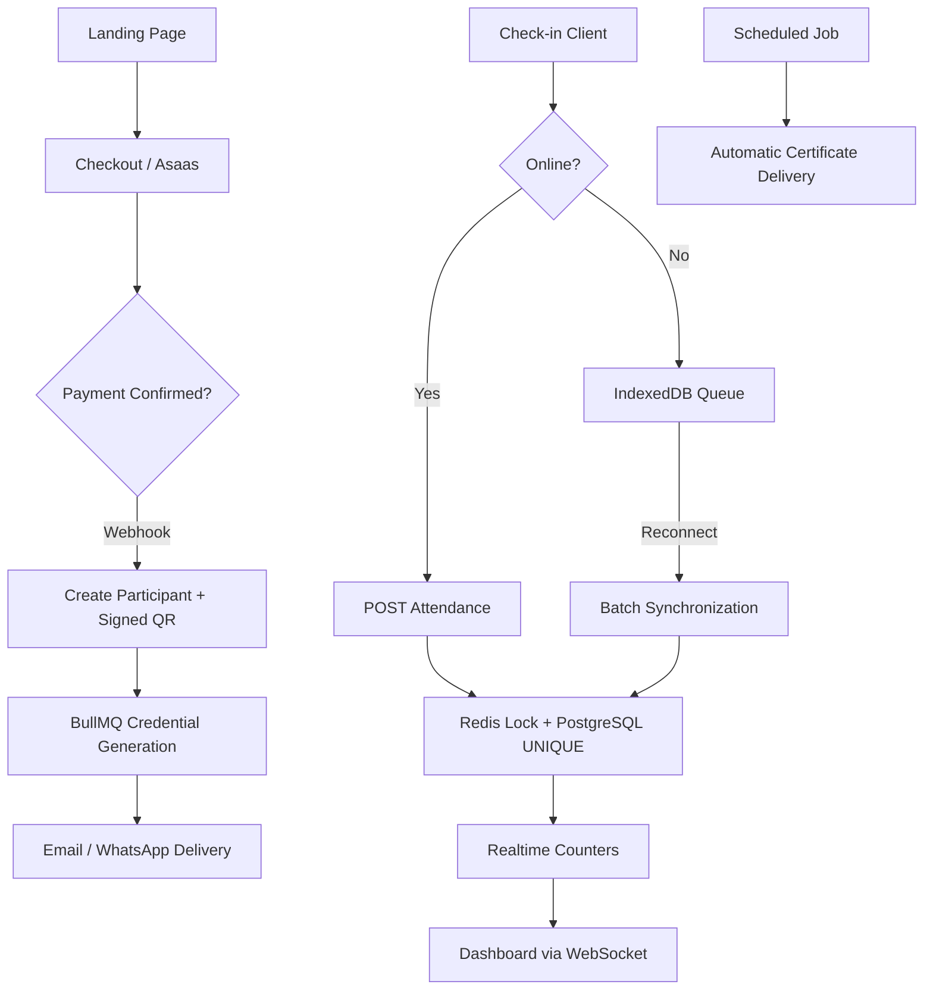

<div align="center">

# Entter

### Modern Event Ticketing, Digital Credentials & Lightning-Fast QR Check-in

*A scalable event management platform built to keep check-ins fast, reliable, and resilient—even under unstable network conditions.*

[](#roadmap)
[](./LICENSE)
[](https://nodejs.org)
[](https://nextjs.org)
[](https://nestjs.com)
[](https://postgresql.org)
[](https://redis.io)

</div>

---

> **Entter** is an event management platform focused on **performance, reliability, and user experience**. It combines ticket sales, personalized credential generation, QR-based attendance tracking, and automated certificate delivery into a single system designed to scale from small meetups to large conferences.

---

# ✨ Features

| Feature | Description |
|----------|-------------|
| 🎟 Ticketing | Sell tickets with integrated payments via Asaas. |
| 🪪 Digital Credentials | Automatically generate personalized event badges from organizer templates. |
| 🖱 Visual Editor | Drag-and-drop positioning editor using percentage-based coordinates. |
| 📱 QR Check-in | High-speed QR scanning with duplicate protection. |
| 📶 Offline Support | Continue scanning even without internet. Synchronizes automatically once online. |
| 👥 Manual Attendance | Roll-call mode for single-day events. |
| 📊 Live Dashboard | Real-time attendance analytics powered by WebSockets. |
| 📄 Certificates | Automatic or manual certificate generation and delivery. |

---

# 🚀 Why Entter?

Most event platforms work perfectly...

...until hundreds of attendees arrive simultaneously.

Typical problems include:

- Slow venue Wi-Fi
- Duplicate check-ins
- Frozen dashboards
- Staff unable to continue working offline

Entter was engineered around a single principle:

> **Check-in must remain fast, accurate, and reliable regardless of network quality.**

---

# 🏗 Engineering Highlights

These are the core architectural decisions that differentiate Entter.

| Decision | Why it matters |
|-----------|----------------|
| **Client-side signature validation** | QR payloads contain signed participant information. The client validates the signature locally, immediately displaying attendee information while the server persists the attendance asynchronously. |
| **Offline-first synchronization** | Every scan is stored in IndexedDB when offline and synchronized later with exponential backoff. Staff never need to stop scanning because connectivity is lost. |
| **Redis Lock + PostgreSQL Constraint** | Redis prevents simultaneous duplicate scans while PostgreSQL guarantees data integrity through a UNIQUE constraint. Two independent protection layers cover different failure scenarios. |
| **Percentage-based positioning** | Credential layouts remain perfectly aligned regardless of export resolution or template dimensions. |
| **Unified attendance model** | Manual attendance and QR check-ins share the same database model, avoiding duplicated business logic while simplifying analytics. |

---

# 🏛 Architecture



For the complete system specification—including modules, database schema, API reference, and security architecture—see:

**`docs/ARQUITETURA_credenciamento_eventos.md`**

---

# 🛠 Tech Stack

| Layer | Technologies |
|---------|-------------|
| Frontend | Next.js 15, React, TypeScript, Tailwind CSS |
| Backend | NestJS, TypeScript |
| Database | PostgreSQL |
| ORM | Prisma |
| Cache | Redis |
| Queues | BullMQ |
| Authentication | JWT + HTTP-only Cookies |
| Payments | Asaas |
| Image Processing | Sharp |
| PDF Generation | pdf-lib |
| QR Scanner | BarcodeDetector API + ZXing fallback |
| Real-time | WebSockets |

---

# 📂 Repository Structure

```text
entter/
│
├── backend/
│   ├── src/
│   └── prisma/
│
├── frontend/
│   ├── app/
│   ├── components/
│   └── public/
│
├── docs/
│
├── README.md
└── LICENSE
```

---

# ⚙️ Getting Started

## Clone the repository

```bash
git clone https://github.com/Castro-arch/Entter.git

cd Entter
```

## Install dependencies

```bash
npm install
```

## Backend

```bash
cp backend/.env.example backend/.env

npm run --workspace backend prisma:migrate

npm run --workspace backend start:dev
```

Runs on:

```
http://localhost:3000
```

---

## Frontend

```bash
cp frontend/.env.example frontend/.env.local

npm run --workspace frontend dev
```

Runs on:

```
http://localhost:3001
```

The frontend authenticates against the backend using secure HTTP-only cookies. Configure `FRONTEND_URL` appropriately in the backend environment variables.

---

# 📈 Roadmap

- ✅ Authentication system
- ✅ Event management
- ✅ Ticket sales
- ✅ Payment integration (Asaas)
- ✅ Credential generation
- ✅ Drag-and-drop credential editor
- ✅ QR Check-in
- ✅ Offline-first synchronization
- ✅ Live dashboard
- ✅ Certificate generation
- ✅ Public event pages
- ✅ Organizer dashboard redesign

### Planned

- ⏳ Multi-language support
- ⏳ Email template customization
- ⏳ AWS S3 storage
- ⏳ Event reports
- ⏳ Organizer roles & permissions
- ⏳ Mobile check-in application

---

# 🤝 Contributing

Contributions are always welcome.

If you'd like to improve Entter:

1. Fork the repository
2. Create a feature branch
3. Commit your changes
4. Push your branch
5. Open a Pull Request

Bug reports, ideas, and discussions are also appreciated.

---

# 📄 License

This project is licensed under the **MIT License**.

See the [LICENSE](LICENSE) file for details.

---

# 👨‍💻 Author

Developed by **Castro**.

If you found this project interesting, consider giving it a ⭐ on GitHub.
