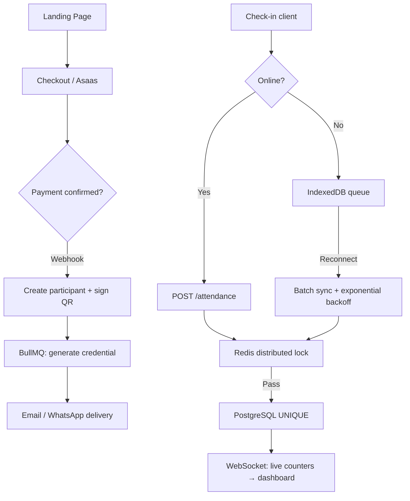

<div align="center">

# Entter

</div>

<p align="center">
  <a href="#roadmap"></a>
  <a href="./LICENSE"></a>
</p>

**Offline-first event check-in — QR payloads validated at the client, attendance persisted async, duplicates blocked at two independent layers.**

Entter handles ticket sales, digital credential generation, and QR-based attendance tracking. The scanner client validates each QR signature locally using SubtleCrypto and a public key — no server round-trip, no dependency on venue Wi-Fi. Scans queue in IndexedDB when offline and replay with exponential backoff on reconnect. On the server, a Redis distributed lock and a PostgreSQL UNIQUE constraint on `(event_id, participant_id)` act as two independent duplicate barriers: Redis catches concurrent scans from multiple devices; the constraint covers Redis restarts, network partitions, and anything that bypasses the cache layer.

```
[entter] DevConf SP · 1 200 registered · 3 check-in devices

  ✓  001  Lucas Andrade      <3ms  local      Workshop A — 09:00
  ✓  002  Marina Ferreira    <3ms  local      Keynote — 10:00
  ✓  003  Rafael Costa       <3ms  local      Workshop B — 09:00
  ⚡  network lost — offline mode active
  ✓  004  Priya Mendes       <3ms  local  (queued)
  ✓  005  João Moura         <3ms  local  (queued)
  ·  reconnecting ···
  ✓  synced 89 scans — 0 duplicates · 1 111 remaining
```

---

## The check-in moment

Most event platforms assume a stable connection at the gate — a reasonable assumption until 300 attendees arrive at once and the venue Wi-Fi collapses. The usual failure mode is scans that stall, screens that freeze, and staff falling back to printed lists.

Entter treats the connection as optional:

- **QR payloads are self-contained.** Each QR encodes a signed JWT with the participant's name, ticket tier, and event slug. The check-in client holds the event's public key and validates the signature locally. The attendee's name appears instantly. The server is never in the critical path for a scan.
- **IndexedDB is the buffer.** Every validated scan is written to IndexedDB synchronously. When online, scans flush to the API immediately. When offline, they queue and replay in order on reconnect — staff never stop scanning because the network dropped.
- **Two duplicate barriers.** Redis catches concurrent duplicates across multiple devices in real time with a distributed lock. The PostgreSQL UNIQUE constraint catches everything Redis misses. Both layers are necessary because each covers a different failure mode.

---

## Core architecture

| Layer | Mechanism | Why it matters |
|---|---|---|
| **QR validation** | ECDSA signature verified client-side with SubtleCrypto | Sub-3ms response, no server round-trip, works fully offline |
| **Offline sync** | IndexedDB queue + exponential backoff replay | Connectivity is a performance concern, not a correctness one |
| **Duplicate prevention** | Redis lock (fast path) + PostgreSQL UNIQUE (hard guarantee) | Two independent layers cover different failure modes |
| **Credential layout** | Percentage-based coordinates, Sharp for rendering | Badge alignment survives any change in template dimensions or export resolution |
| **Credential delivery** | BullMQ job queue → email + WhatsApp | Generation is async; the payment webhook returns immediately |
| **Real-time dashboard** | WebSocket counters pushed per scan | Organizers see live attendance without polling |

---

## Architecture


```mermaid
flowchart TD
    A[Landing Page] --> B[Checkout / Asaas]
    B --> C{Payment confirmed?}
    C -->|Webhook| D[Create participant + sign QR]
    D --> E[BullMQ: generate credential]
    E --> F[Email / WhatsApp delivery]

    G[Check-in client] --> H{Online?}
    H -->|Yes| I[POST /attendance]
    H -->|No| J[IndexedDB queue]
    J -->|Reconnect| K[Batch sync + exponential backoff]

    I --> L[Redis distributed lock]
    K --> L
    L -->|Pass| M[PostgreSQL UNIQUE]
    M --> N[WebSocket: live counters → dashboard]
```

Full system spec — modules, schema, API reference, security model:
**[`docs/ARQUITETURA_credenciamento_eventos.md`](docs/ARQUITETURA_credenciamento_eventos.md)**

---

## Stack

| Layer | Technologies |
|---|---|
| Frontend | Next.js 15, TypeScript, Tailwind CSS |
| Backend | NestJS, TypeScript, Prisma |
| Database | PostgreSQL, Redis |
| Queues | BullMQ |
| Auth | JWT + HTTP-only cookies |
| Payments | Asaas |
| Image processing | Sharp |
| PDF generation | pdf-lib |
| QR scanning | BarcodeDetector API, ZXing fallback |
| Real-time | WebSockets |

---

## Getting started

```bash
git clone https://github.com/Castro-arch/Entter.git
cd Entter
npm install
```

### Backend

```bash
cp backend/.env.example backend/.env
npm run --workspace backend prisma:migrate
npm run --workspace backend start:dev
# → http://localhost:3000
```

### Frontend

```bash
cp frontend/.env.example frontend/.env.local
npm run --workspace frontend dev
# → http://localhost:3001
```

The frontend authenticates via HTTP-only cookies. Set `FRONTEND_URL` in the backend `.env` accordingly.

---

## Roadmap

**Shipped**

- Authentication and event management
- Ticket sales with Asaas payment integration
- Credential generation with drag-and-drop editor
- QR check-in with offline-first sync
- Live attendance dashboard via WebSockets
- Certificate generation and delivery
- Public event pages and organizer dashboard

**Planned**

- AWS S3 for credential and certificate storage
- Organizer roles and permissions
- Event reports and export
- Mobile check-in application
- Email template customization

---

## Contributing

Bug reports, ideas, and pull requests are welcome.

1. Fork the repository
2. Create a feature branch
3. Commit your changes and open a pull request

---

## License

MIT — see [LICENSE](LICENSE).
